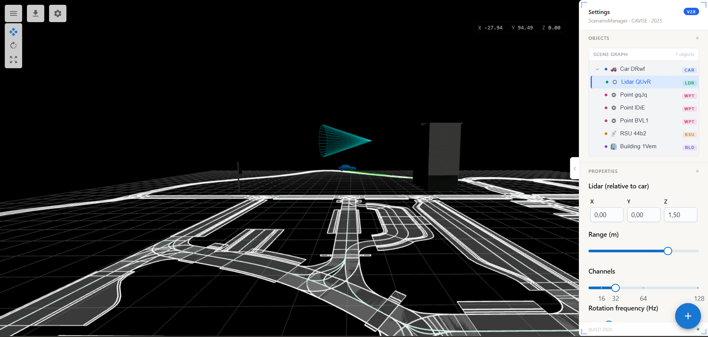

Scenario Manager
================

**A real-time 3D scenario editor for V2X (Vehicle-to-Everything) simulation environments.**
Built for engineers working on autonomous driving and smart infrastructure research.

ScenarioManager is a browser-based 3D scene editor built on top of `OpenDRIVE <https://www.asam.net/standards/detail/opendrive/>`_ road network maps.
It lets you place and configure vehicles, pedestrians, RSUs (Road Side Units), LiDAR sensors, and buildings —
then export scenarios to multiple simulators including OpenCDA, CARLA, SUMO, OMNeT++, Artery, and Sionna.

Scenarios are stored on a backend and can be saved, loaded, and shared across sessions.
The editor features a live scene graph panel, per-object property editing, transform controls, and real-time telemetry monitoring.

.. image:: ../scenarios/images/screenshot-editor.png
   :alt: 3D Editor Viewport — OpenDRIVE road network with a vehicle equipped with LiDAR sensor and route waypoint

.. contents:: On this page
   :local:
   :depth: 2

---

Getting Started
---------------

Prerequisites
"""""""""""""

- Node.js 18+
- A ``.xodr`` road network file (place at ``public/data.xodr``)
- Running backend (see `Backend`_ section below)

Install and Run
"""""""""""""""

.. code-block:: bash

   npm install
   npm run dev

Open http://localhost:5173 in your browser.

Build for production:

.. code-block:: bash

   npm run build

Run tests:

.. code-block:: bash

   npm run test           # unit tests (Vitest)
   npm run test:e2e       # end-to-end tests (Playwright)
   npm run test:coverage  # coverage report

Docker
""""""

The frontend can be run via Docker Compose using profiles.

.. code-block:: bash

   # Production build
   docker compose --profile prod up

   # Development server with hot reload
   docker compose --profile frontend-dev up

   # Full development stack (frontend + backend)
   docker compose --profile dev up

Common Docker commands:

.. code-block:: bash

   docker compose --profile prod up -d      # run in background
   docker compose down                      # stop all containers
   docker compose --profile prod up --build # rebuild after dependency changes
   docker compose logs -f                   # view logs

---

Usage
-----

.. image:: ../scenarios/images/Screen-Scenario-manager.gif
   :alt: Scene Editor — place and move vehicles, RSUs, and buildings on an OpenDRIVE road network

Adding Objects
""""""""""""""

Use the speed dial button (bottom-right corner) to add objects to the scene:

- **Add Car** — click to enter car placement mode, then click on the road
- **Add RSU** — double-click on the road or open space to place an RSU
- **Add Building** — click to enter building mode, then double-click to place
- **Add Pedestrian** — click to enter pedestrian placement mode, then click to place
- **Add Route Points** — select a car first, then use Add Points to define its route

Selecting and Editing
"""""""""""""""""""""

- **Click** any object in the viewport to select it and open its properties in the right panel
- **Click** any object in the Scene Graph tree to select it and attach transform controls
- Use the **transform toolbar** (top-left) to switch between Translate / Rotate / Scale modes
- Press **Escape** to deselect and save current transforms
- Press **Delete** to remove the selected object

.. image:: ../scenarios/images/Screen-Scenario-manager-panel.gif
   :alt: Scene Graph Panel — hierarchical object tree with live position readout and type badges

Saving and Loading
""""""""""""""""""

- Click **Save** in the toolbar to persist the scenario to the backend
- Click **Load** to browse and restore previously saved scenarios
- Scenarios are stored server-side and identified by ``scenario_id``

---

Exporting Configs
-----------------

.. image:: ../scenarios/images/Screen-Scenario-manager-config.gif
   :alt: Export Configs — generate config files for OMNeT++, Artery, Sionna, CARLA, OpenCDA, SUMO, and more

Once your scenario is set up, click the **download icon** in the toolbar to open the export menu.
Configs are generated from the current scene state — vehicles, RSUs, pedestrians, routes, LiDAR sensors, and simulation parameters.

Supported simulators:

.. list-table::
   :header-rows: 1
   :widths: 20 20 15 45

   * - Category
     - Simulator
     - Format
     - Description
   * - V2X
     - OMNeT++
     - ``.ini``
     - Network simulation config with RSU positions and vehicle routes
   * - V2X
     - Artery
     - ``.ini``
     - Artery V2X framework config derived from OMNeT++
   * - V2X
     - CAPI
     - ``.ini``
     - CAPI OMNeT++ config with path loss and radio medium settings
   * - Channel / Ray tracing
     - Sionna
     - ``.json``
     - Ray tracing config with carrier frequency, depth, samples, and propagation flags
   * - Driving simulation
     - CARLA
     - ``.yaml``
     - CARLA scenario with vehicle spawns, routes, and sensor definitions
   * - Driving simulation
     - OpenCDA
     - ``.yaml``
     - OpenCDA cooperative driving scenario
   * - Traffic simulation
     - SUMO
     - ``.xml``
     - SUMO network and route files with vehicle and pedestrian definitions
   * - Control
     - MPC
     - ``.yaml``
     - Model Predictive Control parameters

Simulation Settings Dialog
""""""""""""""""""""""""""

.. image:: ../scenarios/images/screenshot-simulation.png
   :alt: Simulation Settings — per-simulator configuration dialog

Before exporting, configure per-simulator parameters via **Settings → Simulation Settings**.

**General**

- ``Duration (s)`` — total simulation time in seconds

**SIONNA**

- ``Carrier Frequency (Hz)`` — e.g. ``5900000000`` for 5.9 GHz DSRC
- ``Max Depth`` — maximum number of ray interactions
- ``Num Samples`` — number of ray paths to compute
- ``LoS`` / ``Reflection`` / ``Diffraction`` / ``Scattering`` — propagation flags

**SUMO**

- ``Net file`` — path to SUMO network file
- ``Step length`` — simulation step in seconds
- ``Full output`` — enable detailed output logging

**CARLA / OpenCDA**

Vehicle models, colors, and routes are taken directly from the scene.
LiDAR sensors are exported with position, range, channels, and rotation frequency.

Export Workflow
"""""""""""""""

.. image:: ../scenarios/images/screenshot-export.png
   :alt: Export Menu — generate config files for multiple simulators

.. code-block:: text

   1. Load .xodr map
   2. Place vehicles, RSUs, pedestrians, buildings
   3. Define vehicle routes (waypoints)
   4. Attach LiDAR sensors to vehicles
   5. Open Settings → configure simulation parameters
   6. Click Export → choose target simulator
   7. Use generated config file with the corresponding simulator

---

Object Types
------------

.. list-table::
   :header-rows: 1
   :widths: 20 20 60

   * - Type
     - ``userData.type``
     - Description
   * - Vehicle
     - ``car``
     - Autonomous vehicle with route and optional LiDAR
   * - RSU
     - ``point``
     - Road Side Unit (V2X infrastructure node)
   * - Pedestrian
     - ``pedestrian``
     - Pedestrian agent with V2X capability
   * - LiDAR
     - ``lidar``
     - Sensor attached to a vehicle
   * - Building
     - ``building``
     - Static environment asset
   * - Waypoint
     - ``circle``
     - Route point belonging to a vehicle

---

Backend
-------

The backend is a **FastAPI** application (Python 3.12) with two layers:

- **Main API** (``app/routes.py``) — scenario storage (PostgreSQL), simulation control, and status polling. Serves the frontend.
- **Simulation API** (``simulation/app/``) — CARLA-connected service that manages scenario execution and reports (SQLite). Runs alongside CARLA.

Stack: FastAPI + Uvicorn, PostgreSQL (psycopg2), OmegaConf + python-dotenv, OpenCDA + CARLA 0.9.15.

Environment Variables
"""""""""""""""""""""

Create a ``.env.local`` file:

.. code-block:: bash

   DB_NAME=
   DB_USER=
   DB_PASSWORD=
   DB_HOST=
   DB_PORT=
   DB_ENCODING=

   CARLA_HOST=localhost   # default
   CARLA_PORT=2000        # default

Running the Backend
"""""""""""""""""""

.. code-block:: bash

   python3 -m venv venv
   source venv/bin/activate
   pip install -r requirements.txt
   uvicorn main:app --host 0.0.0.0 --port 8000 --reload

API Endpoints
"""""""""""""

All routes are prefixed with ``/api``.

**Scenario Management**

.. list-table::
   :header-rows: 1
   :widths: 10 35 55

   * - Method
     - Path
     - Description
   * - ``POST``
     - ``/api/upload_scenario``
     - Save a new scenario to the database
   * - ``GET``
     - ``/api/load_all_scenarios``
     - List all saved scenarios
   * - ``GET``
     - ``/api/load_scenario/{scenario_id}``
     - Load a specific scenario by ID
   * - ``POST``
     - ``/api/update_scenario``
     - Update an existing scenario
   * - ``POST``
     - ``/api/delete_scenario``
     - Delete a scenario by ID

**Simulation Control**

.. list-table::
   :header-rows: 1
   :widths: 10 35 55

   * - Method
     - Path
     - Description
   * - ``POST``
     - ``/api/start_opencda``
     - Start a simulation as a background task
   * - ``GET``
     - ``/api/status``
     - Poll simulation status (``idle`` / ``running`` / ``finished`` / ``error``)
   * - ``POST``
     - ``/api/stop``
     - Stop the running simulation and destroy CARLA actors

Simulation Request Example
""""""""""""""""""""""""""

.. code-block:: json

   {
     "scenario_id": "string",
     "scenario_name": "string",
     "weather": "ClearNoon",
     "map": "town10",
     "scenario": [
       {
         "vehicle": "car",
         "path": [{ "x": 0, "y": 0, "z": 0 }],
         "color": { "r": 127, "g": 0, "b": 0 },
         "active": false
       }
     ]
   }

Simulation Response Lifecycle
"""""""""""""""""""""""""""""

.. code-block:: text

   POST /api/start_opencda  →  { "status": "started", "map": "town10" }
   GET  /api/status         →  { "status": "running", "map": "town10", "error": null }
   GET  /api/status         →  { "status": "finished", ... }

---

Configuration
-------------

Backend port is configured in ``src/VARS.ts``:

.. code-block:: ts

   export const PORT = '8000'; // Backend port

---

Weather Presets
---------------

The following CARLA weather presets are available when configuring a scenario:

``ClearNoon`` · ``CloudyNoon`` · ``WetNoon`` · ``WetCloudyNoon`` · ``SoftRainNoon`` ·
``MidRainyNoon`` · ``HardRainNoon`` · ``ClearSunset`` · ``CloudySunset`` · ``WetSunset`` ·
``WetCloudySunset`` · ``SoftRainSunset`` · ``MidRainSunset`` · ``HardRainSunset``